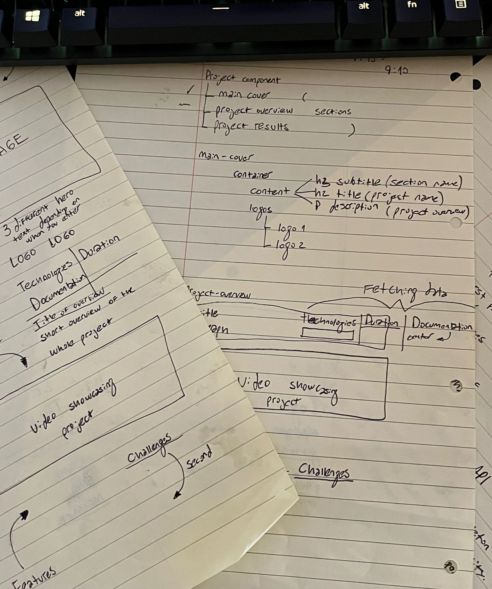

# Portfolio

The nexus of my programming explorations.

## Table of contents
1. [Overview](#overview)
2. [The process](#the-process)
3. [Try it!](#try-it)

## Overview

## The process

### ORIGIN

A seamless fusion of minimalist design and complex storytelling, embodied in a website.

### Current wims... for now

- Speed, speed, speed: It needs to load fast, faster than fast.
- Swiss Grid System: It's just... beautiful.
- Accessibility: To be used for anyone, anywhere.
- Three modes: Dark, light, and retro.
- User authentication.
- CLI: Easter egg, he-he.

### A deeper look into it

## Try it!